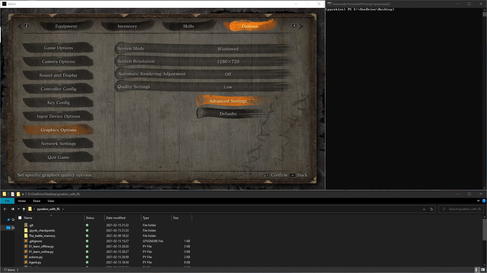

## 用强化学习玩《只狼：影逝二度》

    <a href="https://github.com/ricagj/pysekiro_with_RL/blob/main/README.md">English</a>
    | 
    <a>中文</a>

# 参考
https://github.com/Sentdex/pygta5  
https://github.com/analoganddigital/DQN_play_sekiro  
https://github.com/ZhiqingXiao/rl-book/blob/master/chapter10_atari/BreakoutDeterministic-v4_tf.ipynb  
https://github.com/MorvanZhou/Reinforcement-learning-with-tensorflow/tree/master/contents/5_Deep_Q_Network  

# 说明
- 各模块作用
    - Agent.py 就是DQN，其中的目标网络和评估网络用的是缩小版的resnet
    - 01_learn_offline.py 离线学习，上一个项目留下了的数据集可以拿来离线学习，只不过这 reward 曲线，emmmm
    - 01_learn_online.py 在线学习，需要打开游戏训练模型
    - sekiro_weights.h5 经过一轮训练（监督学习）的模型权重文件，由于训练时数据不平衡的原因，加载了它的模型满脑子想着攻击和苇名抖刀术

    - actions.py 让只狼执行相应的动作
    - directkeys.py 按键松键
    - getkeys.py 按键捕获
    - getstatus.py 状态获取，例如血条，架势条
    - getvertices.py 方便找到血条什么的
    - grabscreen.py 屏幕图像捕获
- 正在优化
    - Agent.py 随以下两个文件调整
        - 01_learn_online.py 训练效果有待提升
        - 01_learn_offline.py 训练效果有待提升
    - actions.py 调试按键时间长度
    - getstatus.py 状态获取暂时无法处理一些特殊情况
    - sekiro_weights.h5 可能会重新训练一个
# 准备

#### 游戏设置
- 打开游戏 《只狼：影逝二度》
    - 设定
        - 显示和声音
            - 亮度调整    5
        - 按键设置
            - 移动
                - 移动 前    W
                - 移动 后    S
                - 移动 左    A
                - 移动 右    D
                - 垫步、（长按）冲刺    .Shift
                - 跳跃    Space
            - 视角操作
                - 重置视角/固定目标    Y
            - 攻击动作
                - 攻击    键盘    J
                - 防御    键盘    K
        - 图像设定
            - 屏幕模式    窗口
            - 屏幕分辨率    1280 x 720
            - 自动绘图调整    OFF
            - 质量设定    低
- 将游戏窗口放在左上角，不能留有空隙，不能打无边框补丁
  

#### 安装 Anaconda3
https://www.anaconda.com/

#### 创建虚拟环境和安装依赖
~~~shell
conda create -n pysekiro python=3.8
conda activate pysekiro
conda install pandas
conda install matplotlib
conda install pywin32
pip install opencv-python>=4.0
pip install tensorflow>=2.0
~~~